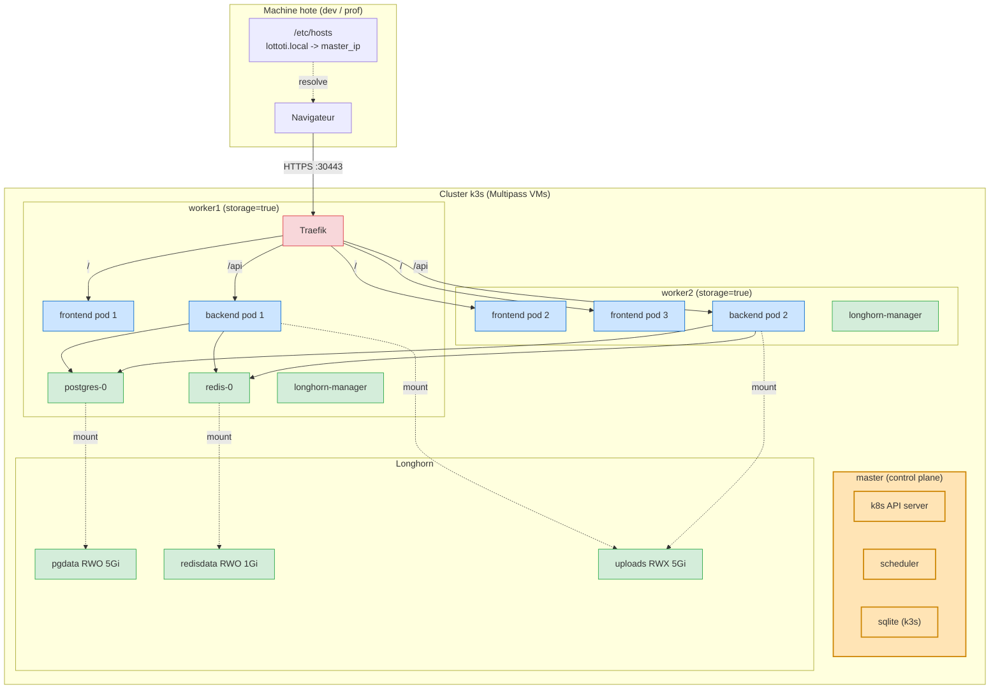
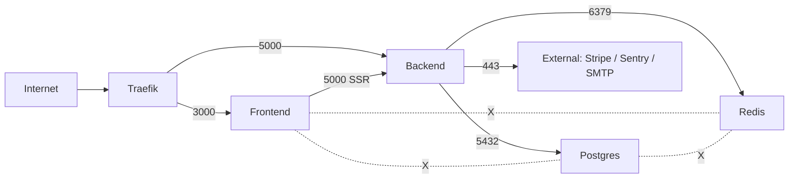

# Architecture du cluster LottoTi

## Vue d'ensemble



---

## 1. Topologie cluster

| Noeud   | Type    | Role                                         | Ressources           |
|---------|---------|----------------------------------------------|----------------------|
| master  | k3s server | Control plane + API server + scheduler   | 2 vCPU / 2 Go RAM    |
| worker1 | k3s agent  | App + Storage Longhorn (storage=true)    | 2 vCPU / 3 Go RAM    |
| worker2 | k3s agent  | App + Storage Longhorn (storage=true)    | 2 vCPU / 3 Go RAM    |

### Labels utilises

```bash
kubectl get nodes --show-labels | grep -E 'storage|lottoti.io/role'
```

| Label                        | Noeuds         | Usage                                            |
|------------------------------|----------------|--------------------------------------------------|
| `storage=true`               | worker1, worker2 | Pin postgres + redis (PVC stables)             |
| `lottoti.io/role=app`        | worker1, worker2 | Preference scheduling backend/frontend         |

---

## 2. Plan de stockage

| PVC           | Mode  | Taille | Tier      | StorageClass | Pourquoi RW?              |
|---------------|-------|--------|-----------|--------------|---------------------------|
| `pgdata-postgres-0` | RWO | 5Gi  | Database  | longhorn     | Une seule replica DB      |
| `redisdata-redis-0` | RWO | 1Gi  | Cache     | longhorn     | Une seule replica cache   |
| `uploads`     | **RWX** | 5Gi  | Backend   | longhorn (NFS) | 2 replicas backend partagent les fichiers uploades |

> Longhorn fournit RWX via un provisionner NFS interne. Sans cette capacite, on devrait ramener backend a 1 replica (KO sujet) ou refactorer le code pour utiliser S3.

---

## 3. Reseau

### Plan d'adressage Pod CIDR (defaut k3s)

- Pod CIDR  : `10.42.0.0/16`
- Service CIDR : `10.43.0.0/16`
- Cluster DNS : `10.43.0.10`

### NodePort exposition

- HTTP  : `30080` -> Traefik web -> redirect HTTPS
- HTTPS : `30443` -> Traefik websecure -> Ingress

### Routes Ingress

| Hote                | Path           | Service       | Port  | Middlewares                             |
|---------------------|----------------|---------------|-------|-----------------------------------------|
| `lottoti.local`     | `/api/health`  | backend       | 5000  | ratelimit-health, security-headers      |
| `lottoti.local`     | `/api/auth`    | backend       | 5000  | ratelimit-auth (5 req/s), security-headers |
| `lottoti.local`     | `/api`         | backend       | 5000  | ratelimit-api (30 req/s), compress      |
| `lottoti.local`     | `/socket.io`   | backend       | 5000  | security-headers (WebSocket)            |
| `lottoti.local`     | `/`            | frontend      | 3000  | security-headers, compress              |
| `api.lottoti.local` | `/`            | backend       | 5000  | (sous-domaine API direct)               |

### NetworkPolicy zero-trust



Tout le reste est bloque par `default-deny-all`.

---

## 4. Cycle de vie d'un deploiement

### Boot froid

1. cert-manager genere le CA root (`lottoti-ca-key-pair`)
2. Le ClusterIssuer `lottoti-ca-issuer` est cree
3. Un `Certificate` lottoti-tls est demande -> cert-manager le signe
4. PostgreSQL StatefulSet provisionne `pgdata-postgres-0` via Longhorn (RWO)
5. Redis StatefulSet provisionne `redisdata-redis-0` via Longhorn
6. PVC `uploads` (RWX) est provisionne via Longhorn NFS provisioner
7. Backend Deployment :
    - initContainer `wait-for-db` : `pg_isready -h postgres`
    - initContainer `wait-for-redis` : `redis-cli ping`
    - main container demarre Gunicorn-gevent
8. Frontend Deployment demarre (Next.js standalone)
9. Ingress + IngressRoute Traefik routent les requetes

### Rolling update zero-downtime

```
Backend Deployment - 2 replicas - maxSurge:1 maxUnavailable:0

t0: [pod-A v1.0.0 Ready] [pod-B v1.0.0 Ready]
t1: [pod-A v1.0.0 Ready] [pod-B v1.0.0 Ready] [pod-C v1.0.1 Pending]    <- maxSurge=1
t2: [pod-A v1.0.0 Ready] [pod-B v1.0.0 Ready] [pod-C v1.0.1 Ready]
t3: [pod-A v1.0.0 Ready] [pod-B v1.0.0 Terminating] [pod-C v1.0.1 Ready]
t4: [pod-A v1.0.0 Ready] [pod-D v1.0.1 Pending] [pod-C v1.0.1 Ready]
... etc
```

Aucun moment ou < 2 pods Ready -> service ininterrompu, garanti par PDB `minAvailable: 1` aussi.

### Rollback

```bash
kubectl -n lottoti rollout undo deploy/backend
kubectl -n lottoti rollout history deploy/backend
```

CI/CD : si `rollout status` timeout > 5 min, le job execute automatiquement `rollout undo`.

---

## 5. Securite

### Secrets

Stockes dans le Secret `lottoti-secrets` :

| Cle                    | Source                          |
|------------------------|---------------------------------|
| `POSTGRES_PASSWORD`    | `openssl rand -hex 24`          |
| `FLASK_SECRET_KEY`     | `openssl rand -hex 32`          |
| `JWT_SECRET_KEY`       | `openssl rand -hex 32`          |
| `STRIPE_SECRET_KEY`    | Dashboard Stripe                |
| `STRIPE_WEBHOOK_SECRET`| Dashboard Stripe                |

> En prod reel : utiliser **External Secrets Operator** + Vault, ou **SealedSecrets**, pas committer le `.secrets.env`.

### TLS

- Niveau 1 : `selfsigned-bootstrap` (boot le CA)
- Niveau 2 : `lottoti-ca` (CA root, 10 ans, ECDSA P-256)
- Niveau 3 : `lottoti-tls` (cert servi par Traefik, 90 jours, renouvellement auto)

### Pod Security

- Namespace `lottoti` enforce **baseline** Pod Security Standard
- Postgres : runAsNonRoot via image officielle (UID 999)
- Frontend : runAsUser 1001 (defini dans Dockerfile Next.js)
- Backend : runAsUser non-root (defini dans Dockerfile Flask)

### NetworkPolicy

Voir section 3 - zero-trust strict.

---

## 6. Observabilite

### Logs

- **stdout/stderr** sur tous les conteneurs
- `kubectl logs -n lottoti deploy/backend --tail=100 -f`
- `kubectl logs -n lottoti deploy/frontend -c web --tail=100 -f`

### Health checks

- Backend `/api/health` -> startupProbe (150s grace), liveness, readiness
- Frontend `/` -> startupProbe, liveness, readiness
- DB : `pg_isready` exec probe
- Redis : `redis-cli ping` exec probe

### Metrics (k3s integre)

```bash
kubectl top nodes
kubectl top pods -n lottoti
```

(metrics-server est deploye automatiquement par k3s -> source pour HPA)

---

## 7. Decisions architecturales

| Choix                                | Pourquoi                                           |
|--------------------------------------|----------------------------------------------------|
| **k3s** vs k8s vanilla               | Sujet recommande, leger, certified k8s             |
| **Longhorn** vs local-path / NFS     | Seul SC qui fournit RWX out-of-the-box pour uploads |
| **Traefik v3** custom vs k3s integre | Permet IngressRoute CRD + middlewares fins        |
| **cert-manager** vs Let's Encrypt    | Cluster local sans IP publique -> CA self-signe    |
| **Kustomize** + Helm chart           | Kustomize pour le base; Helm pour multi-tenant   |
| **WebSocket sticky session**         | Backend Gunicorn-gevent single worker -> pubsub Redis sinon. ClientIP en ceinture+bretelles |
| **Secrets via openssl** + script     | Demo-friendly. Vault/ESO en prod reel.             |

---

## 8. Limitations connues

| Limitation                                  | Mitigation                                         |
|---------------------------------------------|----------------------------------------------------|
| 1 seule replica DB                          | Sujet l'autorise. Pour HA reel : Patroni ou Cloud SQL |
| Multipass VMs ephemeres                     | Backup PVC via `velero install`                    |
| Pas de monitoring Prometheus/Grafana        | Hors scope. Bonus possible.                        |
| Pas de tracing distribue                    | Sentry suffit pour la demo                         |
| CA local non installee dans le browser      | Bouton "avance" en demo. Doc dans README.          |
